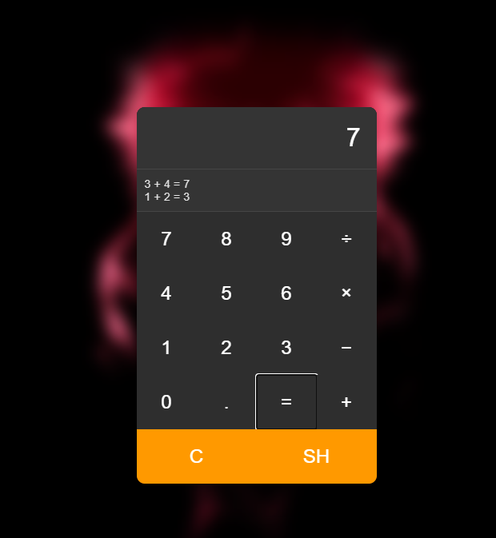

# Simple Calculator Web App

This is a basic calculator web application built using HTML, CSS, and JavaScript. It supports essential arithmetic operations and comes with a simple history feature.

## 🔢 Features

- **Basic Arithmetic Operations**  
  Supports addition, subtraction, multiplication, and division with real-time display of results.

- **History Feature (SH Button)**  
  - Press the `SH` button to **show recent calculations**.
  - The calculator keeps track of the **last 999 entries**.
  - **Note:** The history is **not persistent**. It will be lost upon page refresh.

- **Clear Button (C)**  
  Press the `C` button to **clear the current input and result** instantly.

- **Responsive Design**  
  The layout adjusts to different screen sizes for better usability on desktops and mobile devices.

## 🚀 How to Use

1. Clone or download the repository.
2. Open the `index.html` file in any modern web browser.
3. Start using the calculator!

## 📌 Notes

- This is a beginner-level project intended for learning and demonstration purposes.
- Future updates may include localStorage for persistent history or advanced operations like percentage and square root.

## 📸 Screenshot

## 📄 License

This project is open-source and free to use.

