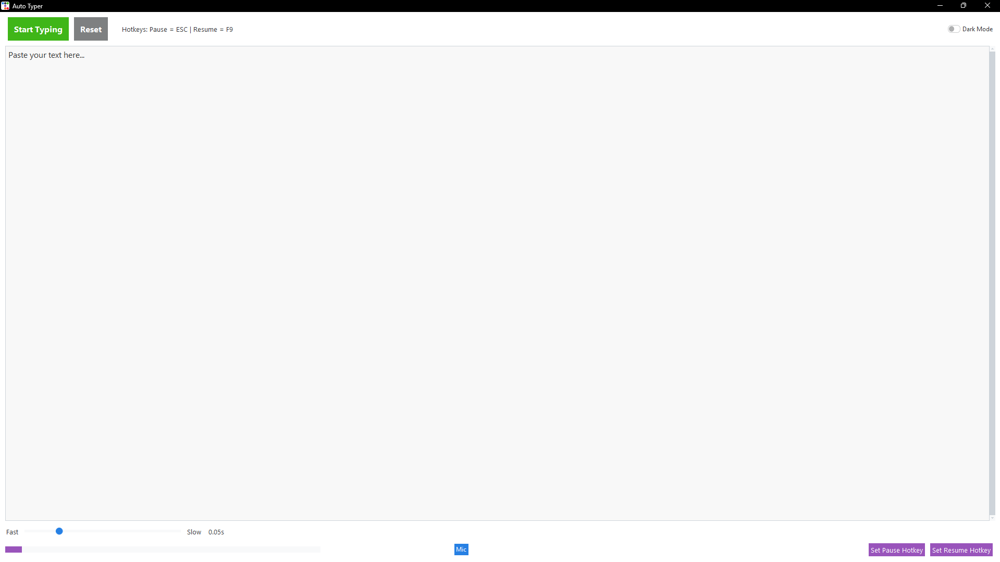
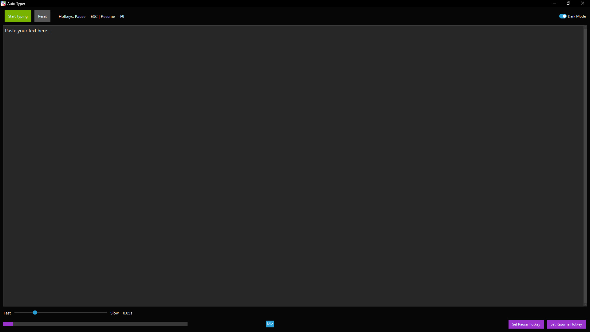

# 🖱️ Typing Simulator with Speech-to-Text 🎤

A lightweight automation tool that simulates human-like typing, even on websites where copy-paste is disabled. Includes adjustable typing speed, keyboard shortcuts, and voice-to-text functionality.

---

## 📌 Introduction

Typing Simulator automates typing tasks in restricted or repetitive input scenarios. Designed during Python practice, it combines GUI simplicity with powerful automation and accessibility support.

---

## ✨ Features

- **✅ Type in Restricted Fields**  
  Simulates keystrokes to type even where pasting is blocked.

- **🎚️ Adjustable Typing Speed**  
  Control typing delay with a speed slider.

- **⏯️ Playback Controls**  
  - `F9` to start  
  - `Esc` to pause/resume  
  (Keys can be modified in code)

- **🎤 Voice Typing**  
  Click the mic button to speak—speech is converted into text and typed automatically.

- **🖼️ Simple GUI**  
  Includes input area, control buttons, mic support, and slider.

---

## 🖼️ Screenshot

> *(Save your UI screenshot as `screenshot.png` in the project folder)*
Light mode: 
 Dark mode: 

---

### 🐍 Prerequisite

- Python 3.6 or later  
Light mode [Download Python](https://www.python.org/downloads/)


### 📦 Required Packages

Install the dependencies by running:

```bash
pip install ttkbootstrap
pip install Pillow
pip install keyboard
pip install pyautogui
pip install SpeechRecognition
pip install pyaudio
```

### ⚠️ Windows - PyAudio Installation

If you face issues installing `pyaudio`:

1. Go to: https://www.lfd.uci.edu/~gohlke/pythonlibs/#pyaudio  
2. Download the `.whl` file matching your Python version and system.
3. Run:

```bash
pip install PyAudio‑0.2.11‑cp39‑cp39‑win_amd64.whl
```


### ▶️ Run the Project

After setup, run the application:

```bash
python "Automated Typing Simulator.py"

```


## 📜 License

Licensed under the **MIT License** — open for educational and personal use.


